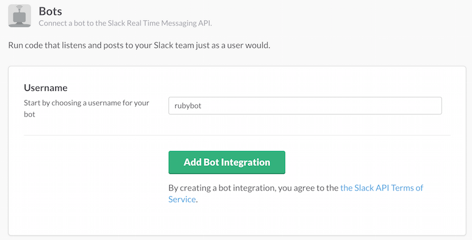

## Web API Basics

Web API reference is [here](https://api.slack.com/web). It includes methods that manipulate channels, chats, emojis, files, groups, ims, pins, reactions, search, stars, teams and users.

### Make a Team

Sign up at [slack.com](https://slack.com), my team is _dblockdotorg.slack.com_.

### Create a New Bot Integration

This is something done in Slack, under [integrations](https://artsy.slack.com/services). Create a [new bot](https://artsy.slack.com/services/new/bot), and note its API token.



### Gemfile

```ruby
source 'http://rubygems.org'
```

### Test

```ruby
require 'http'
require 'json'

rc = HTTP.post("https://slack.com/api/api.test")
puts JSON.pretty_generate(JSON.parse(rc.body))
```

```json
{
  "ok": true
}
```

### Auth

#### Failing Auth

```ruby
rc = HTTP.post("https://slack.com/api/auth.test")
puts JSON.pretty_generate(JSON.parse(rc.body))
```

```json
{
  "ok": false,
  "error": "not_authed"
}
```

#### Succeeding Auth

```ruby
rc = HTTP.post("https://slack.com/api/auth.test", params: { token: ENV['SLACK_API_TOKEN'] })
puts JSON.pretty_generate(JSON.parse(rc.body))
```

```json
{
  "ok": true,
  "url": "https://dblockdotorg.slack.com/",
  "team": "dblock",
  "user": "rubybot",
  "team_id": "T04KB5WQH",
  "user_id": "U07518DTL"
}
```

### Messages

```ruby
HTTP.post("https://slack.com/api/chat.postMessage", params: {
  token: ENV['SLACK_API_TOKEN'],
  channel: '#general',
  text: 'hello world'
})
```

```json
{
  "ok": true,
  "channel": "C04KB5X4D",
  "ts": "1444747472.000002",
  "message": {
    "text": "hello world",
    "username": "bot",
    "type": "message",
    "subtype": "bot_message",
    "ts": "1444747472.000002"
  }
}
```

Post with `as_user: true` on behalf of the bot user.
